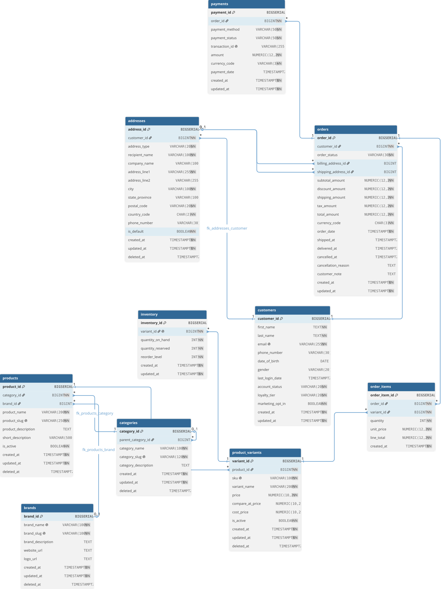

# ecommerce SQL project

 A sql project on ecommerce data. Ongoing as on June 14, 2026.

## Project Structure

```text
ecommerce-sql-project/
├── docs
│   └── creating-table.md
├── exports
├── LICENSE
├── queries
├── README.md
├── schema
│   ├── 001_create_customers.sql
│   ├── 002_create_addresses.sql
│   ├── 003_create_categories.sql
│   ├── 004_create_brands.sql
│   ├── 005_create_products.sql
│   ├── 006_create_product_variants.sql
│   ├── 007_create_inventory.sql
│   ├── 008_create_orders.sql
│   ├── 009_create_order_items.sql
│   └── 010_create_payments.sql
├── scripts
│   └── setup_database.sql
└── seed_data
    ├── 001_customers.sql
    ├── 002_addresses.sql
    ├── 003_categories.sql
    ├── 004_brands.sql
    ├── 005_products.sql
    ├── 006_product_variants.sql
    ├── 007_inventory.sql
    ├── 008_orders.sql
    ├── 009_order_items.sql
    └── 010_payments.sql
```

## Entity Relationship (ER) Diagram


**Interactive Diagram:** https://dbdocs.io/b.sarma1729/Ecommerce-Databse-ER-Diagram?view=relationships

